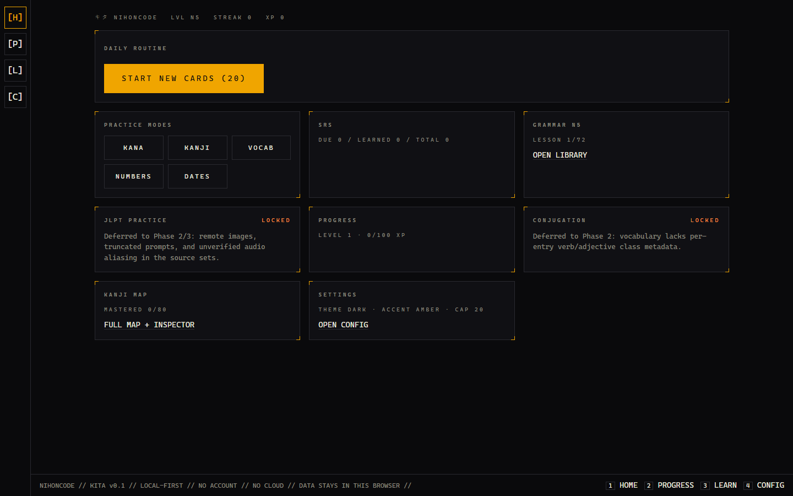

# キタ — Kita

```
NIHONCODE // KITA v0.1 // LOCAL-FIRST // NO ACCOUNT // NO CLOUD // DATA STAYS IN THIS BROWSER //
```

A Japanese practice app that looks like a command deck and behaves like one. No install, no login, no API keys, no server. You open a tab, the daily-routine card tells you what to do right now, and five minutes later you have XP, a streak day, and cards scheduled by FSRS. Close the tab. Everything is still there — in your browser's IndexedDB and localStorage, and nowhere else.

Clearing browser data erases all progress. There is no backup. That is the whole backend story.


_Fresh install, honest zeros — every readout is stored state or zero, and locked panels say why._

## What runs today (Phase 1 MVP)

```
┌ DAILY ROUTINE ──────────────────────────────────────────────┐
│ [ START REVIEW (12 due, ~2 min) ]                           │
├─────────────────────────────────────────────────────────────┤
│ KANA       46 hiragana + 46 katakana, romaji-graded         │
│ KANJI N5   80 entries, dictionary-marker-free answers       │
│ VOCAB N5   641 graded entries with genuine Latin romaji     │
│ NUMBERS    algorithmic, 1–999999, both directions           │
│ DATES      weekdays + full dates with irregular counters     │
│ GRAMMAR    72 reviewed N5 lessons with quizzes, resumable    │
│ SRS        FSRS scheduling, due-before-new, daily new cap    │
├─────────────────────────────────────────────────────────────┤
│ PROGRESS   XP · quadratic level curve · streak · weekly      │
│            bars · achievements · kanji mastery map with      │
│            docked inspector · coverage of studied material   │
├─────────────────────────────────────────────────────────────┤
│ AUDIO      Web Speech API with Japanese-voice detection;     │
│            no voice → visible N/A state, text study never    │
│            blocks                                            │
└─────────────────────────────────────────────────────────────┘
```

Drill contract: one item at a time, typed answer, `Enter` submits, `Enter` advances, `Esc` aborts (with confirm — an aborted session awards nothing). Reveal teaches every script and meaning; on a miss it also shows every accepted reading and the item's group. Retry reshuffles. XP lands on completion only.

Locked panels are honest: JLPT practice and conjugation show _why_ they are locked (dirty source data, Phase 2/3), never a dead tile.

## The data stance

The bundled datasets shipped with measured defects (mislabeled romaji fields, dictionary markers in answers, truncated prompts, unverified audio mapping — all ledgered in [docs/data-quality.md](docs/data-quality.md)). Every N5 and N4 entry was then manually curated: 2,298 verdicts in [`curation/adjudications.json`](curation/adjudications.json) (fix / replace / exclude, each with a reason).

The result is [`data/clean/`](data/clean/) — the app's single source of truth, committed and read only through a Zod validation gate ([`src/content/gate.ts`](src/content/gate.ts)) that flags and excludes anything malformed — never crashes on it, never lets it reach a graded question. `scripts/audit-clean.mjs` proves the tracked pool defect-free with unique IDs; no raw scrape remains in the repository, so there is exactly one dataset to read, edit, or trust.

The app grades N5 today (46+46 gojuon, 80 kanji, 738 vocab, 72 grammar lessons); N4–N1 and JLPT pools exist in `data/clean/` and enable in Phase 3. Spec in [DEVELOPMENT_PROMPT.md](DEVELOPMENT_PROMPT.md).

## The look

Near-black ground, hairline panel borders with corner ticks, one monospace voice at three registers, tracked-caps micro-labels, ASCII ornament. One accent per semantic role — amber for the primary action, green mastered, blue learning, orange due, red critical — and a user-selectable accent that touches the primary action only. No glass, no gradients, no rounded shells, no shadows, no confetti. Every number on screen is your own stored state or an honest zero.

The rules are executable: [`scripts/check-taste.mjs`](scripts/check-taste.mjs) fails the build on inline styles, hardcoded colors, glass, gradient fills, and rounded shells. The full grammar lives in [DESIGN.md](DESIGN.md). Dark is the default and the primary target; light carries the same hairline grammar.

## Run it

```
npm install                  # once
npx playwright install chromium   # once, for the eval
npm run dev                  # vite dev server
npm run dev:isolated         # collision-free port + machine-readable ready line
npm run check                # typecheck, lint, format, arch, taste, docs, data audit
npm test                     # 64 Vitest unit tests
npm run eval                 # 18 Playwright tests on the production build, 1440 + 390
npm run doctor               # full health report (--with-eval adds the browser leg)
npm run gc -- --dry-run      # cleanup candidates + entropy scan
npm run build                # static production bundle
```

Keyboard: `1`–`4` jump HOME / PROGRESS / LEARN / CONFIG on desktop.

## Architecture in one breath

```
src/app          routing, shell, nav rail + bottom command bar
src/features     dashboard · drills · grammar · review · progress · settings
src/domain       grading, FSRS scheduling, XP/streak, numbers/dates — pure, no React
src/content      the gate: Zod schemas over untrusted JSON → typed models + stable IDs
src/storage      Dexie (cards, attempts, sessions) + versioned localStorage prefs
src/components   shared UI: drill session engine, panels, theme, TTS
src/observability  namespaced JSON-lines logger, ring buffer on window.__nihonLog
```

Boundaries are enforced, not documented-and-hoped: [`scripts/check-arch.mjs`](scripts/check-arch.mjs) fails on any `data/` import outside `src/content`, any React/DOM touch in `domain/`, and any cross-feature import. Progress rows reference stable namespaced IDs (`kana:hiragana:あ`, `kanji:n5:水`, `vocab:n5:水|みず`, `grammar:n5:12`), never array positions.

Stack: React 19, TypeScript strict, Vite, React Router, Dexie, ts-fsrs, Zod. Static build, zero runtime network after load.

## Honest status

|                                                     |                                                                                                                                                                                              |
| --------------------------------------------------- | -------------------------------------------------------------------------------------------------------------------------------------------------------------------------------------------- |
| Phase 1 — MVP on the clean slice                    | **shipped and verified** (64 unit + 18 e2e tests green)                                                                                                                                      |
| Phase 2 — data remediation pipeline                 | next; spec in [DEVELOPMENT_PROMPT.md](DEVELOPMENT_PROMPT.md)                                                                                                                                 |
| Phase 3 — N4–N1, JLPT practice, conjugation, polish | gated on Phase 2                                                                                                                                                                             |
| Public release                                      | **non-commercial cleared** (owner decisions 2026-09-23); commercial redistribution of amgidex content still needs author permission — status ledger renders in-app (About → CONTENT SOURCES) |

What is deliberately absent, forever: AI features, accounts, cloud sync, native wrappers, pronunciation scoring, curriculum gating. The non-goals in [PRD.md](PRD.md) are binding.

## Docs

[AGENTS.md](AGENTS.md) is the map for agents and humans alike: authority order, hard rules, commands. The knowledge base lives in [docs/](docs/index.md) — architecture, data-quality ledger, quality evidence, decision log (append-only ADRs), development protocol.

Content sources: amgidex (grammar lists, permitted for non-commercial use), Tatoeba (CC BY 2.0 FR examples), japanesetest4you (exercises/audio/images, owner-confirmed for this project).
